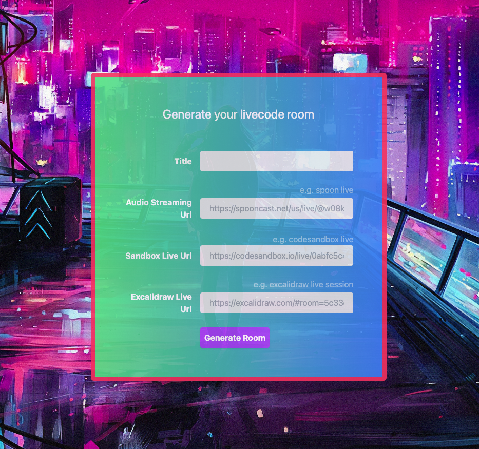
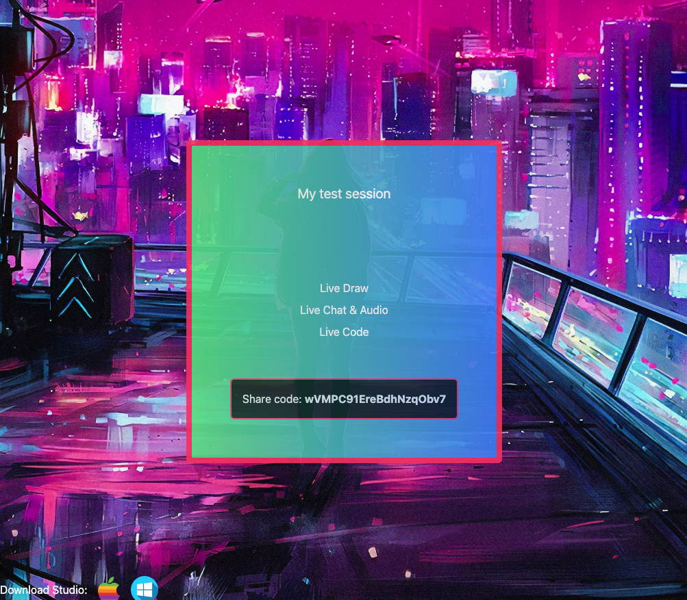
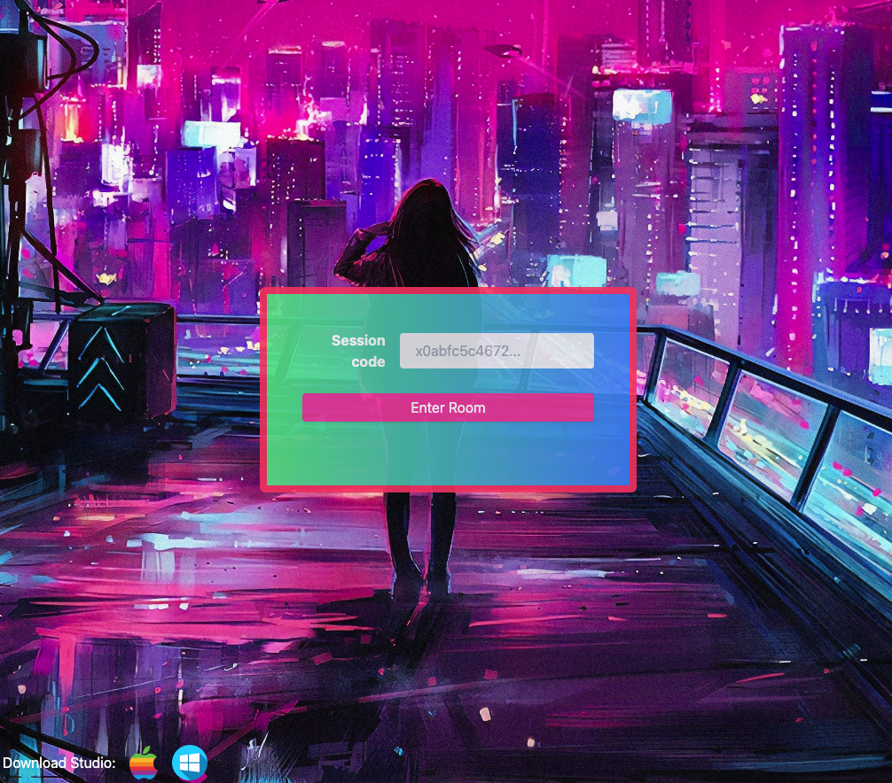
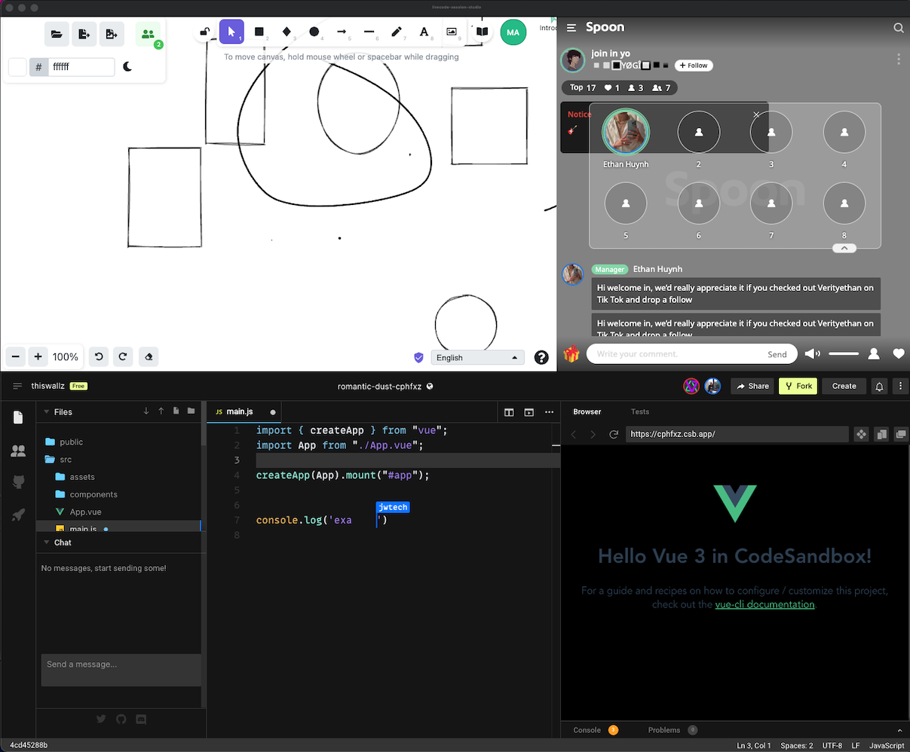

Live Coding Sessions

It is just a simple desk app which puts 3 apps together (code, audio, draw) in a responsiveness way, so you can have all at once, great for sharing sessions since you share just a CODE and they use this to get all other accesses.

#### You can use this as you wish, but here there are some common use cases:

- Mentor who needs to share a live code session with the audience.
- Teacher who wants to share and interact with students.
- Pair programming / Mob programming sessions (give edit permissions on codesandbox).

## Downloads

### Website (to create room): 
[https://livecode-sessions.vercel.app/](https://livecode-sessions.vercel.app/)

### Desktop App (Session Studio): 

Windows: 

MacOS: 

## Apps Recommended

#### Live Code

https://codesandbox.io/ live sessions, which is great for sharing, you can see others peoples interactions with the code, it has a chat also, go to live button and use the share link.

#### Live Audio & Chat

https://www.spooncast.net/ seems to be quite great to stream your lesson, use the share url. 

#### Live Draw 

https://excalidraw.com/ it is great for sharing your draws, you need to create a live session there and use the link. 

You can also use whatever other app as long as you have a clear share URL.

## How to use it

### 1) Content creator
Generate room link for your audience

Share de code

### 2) Creator / Audience / Students
Download desktop app and enter the code: 

Student/Collaborators Studio: 

### Technology

You can use whatever website you want, we do not use iframes,
so it is even possible to embed facebook.

## Stack 

- Next / React / Typescript
- Jotai 
- TailWind CSS 3
- Atomic Design
- Firebase
- Vercel 
- ElectronJS

## Todos 

- List of current live code sessions
- Auth from firebase
- ...

